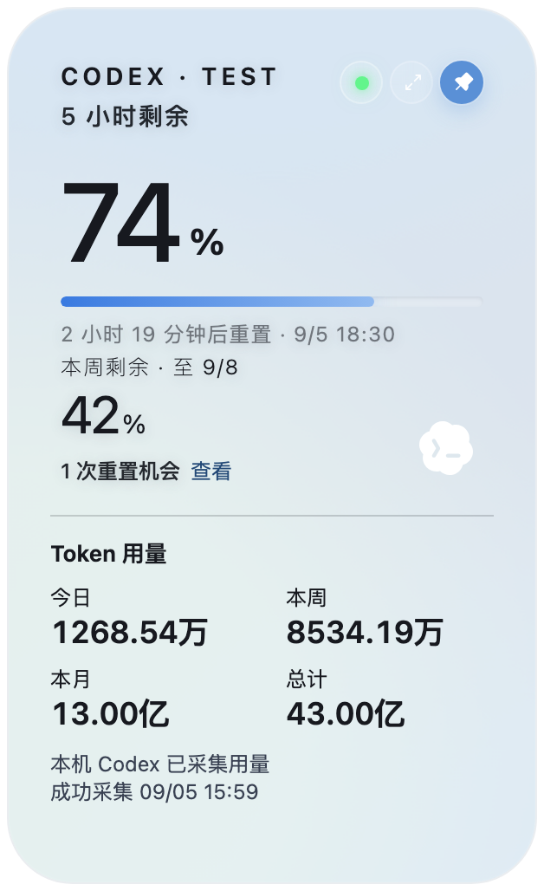

# Codex Monitor

A lightweight, local-first desktop resource monitor for Codex. See your remaining quota, quota reset times, and token usage on this machine in a floating widget.

V1.0.0 is being prepared. Updates are manual: Codex Monitor does not query, download, or install application updates in the background. Use only [Codex Monitor Releases](https://github.com/bennick1/codex-monitor/releases) after the maintainer publishes a version. See the [release validation report](docs/v1.0.0-release-validation-report.md) for the current status.

## Features

- **Lightweight floating widget:** collapses into an orb, expands on hover, with pinning and tray controls.
- **Codex quota monitoring:** remaining 5-hour and weekly quota, reset times, and explicit unavailable/stale states.
- **Token usage statistics:** today, this week, this month, and the total collected on this machine. Summaries use `万` / `亿`; hover or focus a value for its full comma-separated count.
- **Local-first:** incremental session scanning and a local SQLite database; no cloud synchronization or telemetry.
- **Windows/macOS support:** a shared interface with Light, Dark, and Follow system appearances and Chinese/English labels. Platform acceptance is tracked separately in the release report.

Quota comes from the Codex service. Local token counts are a separate measurement and are not used to estimate quota. Totals cover recognized local history, not all usage across your account or devices; incomplete history is marked in the widget.

## Screenshots



Rendered from the current components with synthetic `CODEX · TEST` data. No personal screenshots or statistics are included. This preview is not platform acceptance evidence.

## Installation

Download only from [Codex Monitor Releases](https://github.com/bennick1/codex-monitor/releases). Do not use the upstream project's installers for this fork.

| Platform | V1.0.0 installer | Install |
| --- | --- | --- |
| macOS | `Codex-Monitor-1.0.0.dmg` | Open the disk image and drag **Codex Monitor.app** to Applications. |
| Windows | `Codex-Monitor-1.0.0.exe` | Run the installer as your normal user, then use the **Codex Monitor** Start menu entry. |

V1.0.0 is distributed as **Unsigned / Not Notarized**. macOS may show a Gatekeeper warning and Windows may show an unknown-publisher or SmartScreen warning. It is not Apple verified, notarized, or signed with an Apple Developer ID. Compare the download with the release's `SHA256SUMS` before installing.

For an existing Quota Float installation, quit the old app and preserve its application data before installing. V1 retains the old application identifier to keep settings and token history accessible. After upgrading, verify that the renamed installer and login/startup entry point to Codex Monitor; see the [migration inventory](docs/v1.0.0-name-migration-inventory.md). Do not run both copies together.

## Usage

1. Sign in to Codex on this machine, then launch Codex Monitor.
2. Hover over the orb to view quota and Token Statistics. Pin the card to keep it expanded.
3. Hover or focus each Token value to see the exact count, such as `12,685,398` for `1268.54万`.
4. Use the tray menu to refresh, open the manual release download page, change language/appearance, show or hide the widget, or quit.

On macOS the app is a menu-bar accessory: it intentionally has no Dock or Command-Tab entry. Fullscreen Spaces and sleep/wake behavior must pass the tests in the release report.

Both readers respect `CODEX_HOME`; otherwise they use your home directory's `.codex` folder (`%USERPROFILE%\.codex` on Windows). The token collector scans `sessions` and `archived_sessions`, independently of quota login/network availability. An initial scan may take time. Deleted logs cannot be recovered, but previously collected statistics remain in the local database.

## Privacy

Codex Monitor does not collect or retain prompts, chat history, source code, or account credentials in its statistics database, logs, or telemetry. Statistics stay on this machine.

To read quota, the app accesses the existing local `auth.json` and uses its access token only for the required ChatGPT quota requests. It does not copy credentials to its own storage. The independent token collector reads structured usage records from local session files, skips message bodies, and stores only counters and the minimal timestamps, hashed identities, source references, and checkpoints needed for reliable local statistics.

There is no analytics, tracking, account system, or cloud sync. See [PRIVACY.md](PRIVACY.md) for network and storage details and [SECURITY.md](SECURITY.md) for reporting guidance.

## Development

Requirements: Node.js 22, Rust stable, and the [Tauri 2 prerequisites](https://v2.tauri.app/start/prerequisites/) for your platform. Windows builds require the MSVC toolchain and WebView2; macOS builds require Apple command-line developer tools.

```sh
npm ci
npm test
cargo test --manifest-path src-tauri/Cargo.toml --locked
npm run build
npm run tauri -- dev
```

`npm run dev` is a browser preview with mock data. It cannot validate desktop authentication, native windows, or SQLite integration. Report issues through [Codex Monitor Issues](https://github.com/bennick1/codex-monitor/issues), with personal information removed.

## Build

Run on macOS for an Apple Silicon package:

```sh
npm run tauri -- build --bundles app,dmg --config '{"bundle":{"createUpdaterArtifacts":false}}'
```

For a Universal macOS package, first install both Rust targets and add `--target universal-apple-darwin`. An arm64 package alone is not an Intel build.

Run in PowerShell on Windows for an NSIS installer:

```powershell
npm run tauri -- build --bundles nsis --config '{"bundle":{"createUpdaterArtifacts":false}}'
```

These commands produce release-mode installers with application updater artifacts disabled. Platform signing requires separately configured maintainer certificates. Output is under `src-tauri/target/release/bundle/`, or the target-specific directory for a Universal build.

The [release preparation guide](docs/RELEASE.md) covers naming, SHA256, build provenance, and validation. CI compilation and artifact creation do not replace installation and use on real Windows/macOS machines. No GitHub Release should be created until the maintainer approves the completed report.

## License

[MIT](LICENSE). Based on [Quota Float](https://github.com/change-42-yhmm/quota-float); the original copyright notice is preserved. Codex Monitor is an independent project and is not an official OpenAI product.
