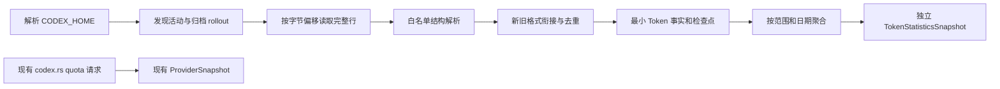

# Codex Monitor V1.0 — Codex Token Collector 设计

## 1. 本步交付与结论

本文是 Step 2 的设计产物，承接 [Step 1 源码分析](quota-float-analysis.md)。仅分析本机 Codex 数据结构并设计 Token Statistics 模块，不包含实现代码、数据库文件、应用逻辑或 UI 修改。

建议以 **Rust 只读扫描 Codex rollout JSONL → 提取最小 Token 事实 → 去重与格式衔接 → 按时间汇总 → 独立统计契约** 实现。现有 quota 请求、`ProviderSnapshot`、刷新锁和错误降级保持原职责。

关键发现：

1. 本机同时存在旧式 `event_msg / token_count` 与新式 `token_usage_record`；后者包含逐 response 用量和标识，应优先使用。
2. 旧式 `total_token_usage` 是累计快照，存在重复及回退。不能累加每一条 total，也不能把最后一条 total 当成所有历史用量。
3. 同一 rollout 可以先写旧格式，后写新格式。不能看到新记录就丢弃整个旧格式历史，也不能同时累计两种记录。
4. 数据是当前本机可读取的活动记录。不能据此宣称账户全量、跨设备全量、官方账单或可换算的 quota 消耗。

文中的“建议”是后续开发输入，不表示已经实现或获得产品口径确认。统计范围问题已向用户提出；尚未答复时按第 4 节保留为待确认建议，不阻塞本步设计文档交付。

## 2. 证据、方法与限制

### 2.1 仓库基线

- 操作系统：macOS（`uname -s` 返回 `Darwin`）。
- 当前仓库：`bennick1/codex-monitor`，`HEAD = 9b9bd1b`，提交说明 `docs: analyze quota-float architecture`。
- 开始检查时工作树干净；本步未 fetch、pull、提交或推送，未核验远端最新提交。
- 当前仍为 Quota Float 0.2.4 的 React / TypeScript / Tauri 2 / Rust 工程。
- 实际检查了 `src-tauri/src/codex.rs` 的目录解析、`lib.rs` 的 `AppState`、`models.rs` 的 snapshot、`src/lib/bridge.ts` 和 `Cargo.toml`。
- 已有 `serde_json`、`chrono`、`dirs`、`sha2` 和 `tokio`；没有 SQLite 或文件监听依赖。现有 `tokio` 显式 features 为 `macros, sync`，不能假设新增异步文件 API 已可用。

### 2.2 本机只读检查

检查日期为 2026-09-05，以下路径以 `<CODEX_HOME>` 代替本机用户目录。

| 检查项 | 证据与边界 |
| --- | --- |
| 目录盘点 | 初次盘点 `sessions` 有 182 个 JSONL，约 956 MB；`archived_sessions` 有 1 个 JSONL，约 3.27 MB。MB 为十进制，运行中的文件会增长 |
| 样本选择 | 按文件 mtime 排序，取最早 3 个、中部 3 个、最近 12 个及归档 1 个，共 19 个；是结构抽样，不是全量账目核算 |
| 固定读入边界 | 2026-09-05 01:11:58 UTC 开始的一轮检查，每文件记录打开时大小，只读取该边界内完整换行记录；样本共 136,417,881 字节。不是跨文件一致性快照 |
| 数据最小化 | 仅输出字段、版本、来源标签、计数及数值关系；未导出正文、真实会话标识、项目路径、认证内容或原始日志 |
| SQLite | 仅以 `mode=ro&immutable=1` 检查现有主文件 schema；没有查询聊天数据、创建数据库或复制数据库。此方式忽略 WAL，只能作为主文件结构证据，不能用于实时统计 |
| 版本证据 | 样本 `cli_version` 包含 `0.142.5`、`0.146.0-alpha.3.1`、`0.146.0-alpha.9.2`、`0.153.0-alpha.5`；这些是 rollout 自报的引擎版本，不等同于 Desktop 安装包版本 |

### 2.3 可重复的数值检查结果

| 项目 | 固定读入边界样本结果 |
| --- | --- |
| `token_count` 条数 | 2,978 |
| 累计 total 等于 input + output | 2,978 / 2,978 |
| 累计 cached ≤ input、reasoning ≤ output | 2,978 / 2,978 |
| 相邻累计向量完全相同 | 48 次 |
| 相邻累计向量出现负差分 | 3 次 |
| 非负且有变化的累计差分 | 2,909 次；五个核心字段均与对应 `last_token_usage` 相等 |
| `token_usage_record` 条数 | 1,081；本轮未见缺失 response id 或重复的 `(thread_id, response_id)` |
| 新记录 `usage` 的 total / 子集关系 | 1,081 / 1,081 满足上述关系 |
| 同 thread 相邻 `thread_token_usage` 差分 | 1,070 次可比较，全部等于当条 `usage` 的五个核心字段 |
| 新记录与随后旧事件 | 1,080 次观察到随后 `token_count`，其中 1,064 次 last 与最近新记录 usage 相等；不能依赖逐条一一配对 |

五个核心字段是 input、cached input、output、reasoning output、total。可选的 `cache_write_input_tokens` 不参与该五字段比较；不能因旧版本缺少第六字段而误判差分异常。

样本中一个会话的新记录 usage 合计为 60,784,745，与末条新记录的 thread 累计一致；该会话末条旧式 total 仅为 9,821,980，并发生 3 次回退。这直接说明只读末条旧快照会漏算。上述数值仅用于说明字段关系，不是用户账户总用量。

### 2.4 官方资料适用范围

- 官方文档说明 Codex 本地状态位于 `CODEX_HOME`，默认 `~/.codex`：[Advanced Configuration — Config and state locations](https://learn.chatgpt.com/docs/config-file/config-advanced#config-and-state-locations)。
- 官方 App Server 文档提供 `thread/tokenUsage/updated` 通知，并描述 `account/usage/read` 的服务端汇总和可空的每日 buckets：[Codex App Server](https://learn.chatgpt.com/docs/app-server)。这些能力存在不等于能旁路订阅正在运行的 Desktop 进程，也不证明本地 JSONL schema 稳定。
- 本步没有调用账户接口、启动 App Server 或改变 Codex 配置。本文的本地字段及新旧格式差异来自本机检查，不将内部文件格式称为公开稳定 API。

## 3. 本地数据结构与数据源选择

### 3.1 目录和候选源

```text
<CODEX_HOME>/
├── sessions/YYYY/MM/DD/rollout-<timestamp>-<id>.jsonl
├── archived_sessions/rollout-<timestamp>-<id>.jsonl
├── session_index.jsonl
├── state_5.sqlite                  # 及既有 WAL / SHM
├── thread_history_1.sqlite         # 及既有 WAL / SHM
├── logs_2.sqlite / goals_1.sqlite / queue_1.sqlite / memories_1.sqlite
├── config.toml
└── auth.json
```

这是本机观察到的结构。数据库数字后缀不是跨版本契约；归档目录在本机为平铺，扫描器应允许其内部子目录。`history.jsonl` 本次未在根目录发现，不能将它作为必需文件。

| 候选源 | 本机事实 | 设计选择 |
| --- | --- | --- |
| rollout JSONL | 包含结构化 Token 事件、时间及会话上下文 | 主数据源；活动和归档进入同一去重域 |
| `session_index.jsonl` | 抽查字段为 `id, thread_name, updated_at` | 无 Token 明细，不依赖标题索引发现会话 |
| `state_5.sqlite` | `threads` 有 `id, rollout_path, tokens_used, archived, cli_version, model, history_mode` 等字段，也包含标题、正文摘要、cwd 等敏感字段 | 不作为 V1 统计源；`tokens_used` 单值不足以支持分类、每日归属与去重，且本步未确认其业务语义 |
| `thread_history_1.sqlite` | `thread_turns, thread_items, thread_history_projection_state, thread_realtime_items`；有 rollout ordinal/byte offset、JSON 内容等字段 | 已检查的主文件 schema 未见独立 Token 明细表；不读取聊天投影来估算 Token |
| 日志、queue、goals、memories 数据库 | 文件存在，未分析数据内容 | 排除；不是本步所需计量来源 |
| `auth.json` / `config.toml` | 文件存在 | Token Collector 不需要读取凭据；不复制 quota 的认证链路 |
| quota API / App Server | 配额与在线服务能力 | 不与本地 Token 数据混算，不从额度百分比反推 Token |

### 3.2 路径解析

沿用现有规则：进程有效 `CODEX_HOME` 优先，否则用户主目录下 `.codex`。macOS 默认 `~/.codex`，Windows 默认用户 profile 下 `.codex`；Windows 是设计目标，本步未实机验证。

扫描范围仅限已解析根目录中的 `sessions` 和 `archived_sessions`。根目录规范化后作为来源命名空间；不自动扫描整个用户目录、其他账户、网络盘或远程机器。GUI 进程与终端环境变量可能不同，返回“目录不可用”时应能区分未找到根目录与未找到会话。

显式 `CODEX_HOME` 为空或无效时返回配置问题，不悄悄改扫另一个目录。对根目录内的链接、Windows junction 和重解析点检查真实路径，默认不跟随越出来源根目录的目标；不能读取管道、设备文件或套接字。

### 3.3 JSONL 外层与上下文

每行是独立 JSON 对象，常见外层字段为 `timestamp, type, payload`；新记录还可有 `ordinal`。字段顺序不构成契约。

| 类型 | 可提取字段 | 用途 |
| --- | --- | --- |
| `session_meta` | `id, session_id, parent_thread_id, timestamp, cli_version, originator, source, thread_source, history_mode` | 身份、来源、版本与关系；忽略 base instructions、git、cwd 和动态工具正文 |
| `turn_context` | `turn_id, root_turn_id, model` | 可选 turn/model 关联；不保存 prompt、summary 或配置正文 |
| `event_msg` + payload.type=`token_count` | `info.total_token_usage, info.last_token_usage` | 旧格式计量；忽略其中 `rate_limits` |
| `token_usage_record` | 见下一节 | 新格式计量 |
| 其他类型 | 仅识别类型并跳过 | 不分析 response、工具输出、reasoning、compacted 正文来估算 Token |

本机同一 rollout 内发现最多 15 条 `session_meta`。重复 metadata 不是新会话或累计清零依据。子代理的 `id` 与 `session_id` 可能不同，不能仅以 `session_id` 聚合全部线程；thread 主身份优先使用 `session_meta.id`，新记录再以 `payload.thread_id` 交叉核对。

样本来源既有 `originator = Codex Desktop`，也有 `codex_work_desktop`，而主会话 `source` 都可为 `vscode`。仅按 `source == vscode` 排除会漏掉 Desktop。originator 可以提供正向识别证据，但不足以证明所有历史或混合客户端会话都能完整分类。

### 3.4 新格式：逐 response 记录

结构示意，使用占位符而非真实会话数据：

```text
type: token_usage_record
timestamp, ordinal?
payload:
  thread_id, turn_id, session_id, root_turn_id, response_id
  usage:                  本条 response 用量向量
  turn_token_usage:        turn 累计向量
  thread_token_usage:      当前新格式计量段的 thread 累计向量
```

采集事实来自 `usage`，后两者用于一致性检查，不能再次相加。把 thread 累计称为“计量段累计”是保守设计：混合格式样本中新格式计量从自身零基线开始，没有携带旧格式的全部历史。

### 3.5 旧格式：累计快照

结构示意：

```text
type: event_msg
payload.type: token_count
payload.info:
  total_token_usage:       累计向量 C
  last_token_usage:        最近一次用量向量 L
  model_context_window:   上下文窗口容量，非累计用量
payload.rate_limits:      配额信息，不进入 Token 统计
```

`last_token_usage` 可能在重复通知中再次出现，不能无条件求和。`info = null`、可选字段缺失、未知类型均需要兼容；这些是设计防御分支，本轮固定样本未发现 null info。

## 4. 统计口径建议与待确认项

### 4.1 来源范围

建议默认统计 **当前本机、当前 CODEX_HOME 下可读取的 Codex 会话**，包括归档、主任务和有独立用量记录的子代理；以实际响应事实去重。删除或未同步到本机的历史、远端主机、云任务、未持久化的会话不在可证范围内。语音会话只有出现兼容的 Token 记录才纳入，不依据时长估算。

这不是“当前登录账户的累计 Token”。登录切换不会改变历史文件的归属；Collector 不读取账户标识来猜测历史账户。若产品必须限定 Desktop，则只纳入可确认 originator 的记录，其余单列 unknown/excluded，且需要确认旧版本来源映射。**全部本机会话还是 Desktop 限定，待用户答复。**

父任务与子代理按各自 response 计数一次；不再把子代理总量加到已经做过树级合并的父总量上。缺少子代理 rollout 时标记范围不完整，不用父累计反推补齐。

### 4.2 指标含义

| 指标 | 字段及规则 |
| --- | --- |
| 输入 Token | `input_tokens`，包含 cached input |
| 缓存输入 Token | `cached_input_tokens`，是输入的子集 |
| 输出 Token | `output_tokens`，包含 reasoning output |
| 推理输出 Token | `reasoning_output_tokens`，是输出的子集 |
| 总 Token | `total_tokens`；已支持样本应等于 input + output |
| 非缓存输入 | input − cached；仅两者有效且关系成立时可推导，不作为新增必选展示项 |

因此 **total = input + output**，不能再加 cached 或 reasoning。`cache_write_input_tokens` 本机新样本可见，作为可选扩展字段保留兼容，不在未知语义下额外加到 total。

所有计数须为非负整数。核心 input/output/total 缺失、负数、溢出或 total 关系冲突时拒收该事实并累计质量问题；不静默改写原数值。cached/reasoning 可选缺失时，主指标仍可计入，缺失维度返回 null 和缺失事实数，而不是当作 0。可选字段存在但违反子集关系时，该维度不可用并标记 partial。

Rust 使用检查溢出的整数运算；Tauri JSON 的计数字段建议使用十进制字符串，防止超过 JavaScript 安全整数范围。格式化单位只发生在未来展示端，底层不提前舍入。

### 4.3 时间范围

本次任务未给出四个统计卡片的最终含义，Step 1 也未定义。建议接口支持日期区间，预置候选为 today、last7Days、last30Days、allAvailable；这是待确认的展示口径，不是新增四项已确定需求。

- today：查询所用系统本地日期的 00:00 到下一日 00:00。
- last7Days / last30Days：含今天的 7 / 30 个自然日；不是滚动 168 / 720 小时。
- allAvailable：所有已纳入的本地可观测记录；不能命名为账户 lifetime。
- 每条事实按 Token 事件的外层 timestamp 归属日期，不按目录日期、会话创建日、mtime 或扫描时间归属。
- 使用 UTC 保存事件时刻，在查询边界统一转换成本地日期；采用左闭右开区间，正确处理夏令时。查询开始时固定本次时区，系统时区变化后重算，不混用缓存旧日期。
- 跨午夜的一次 response 全部归属记录时间；不凭持续时长拆分 Token。
- timestamp 无效的用量进入 undated 部分，不进入日统计；allAvailable 应分别报告 dated 和 undated，明确其和每日 buckets 的差额。
- 旧累计差分跨越日志缺口时，可保留“区间用量”，但若两端跨日期，不把整段强行记在最后一天；放入时间归属不明部分，日统计标记 partial。

统计只描述 Token 活动，不在 V1 推导费用、套餐余额、模型价格或官方计费 Token。

## 5. 采集架构与职责



后续 Rust 模块建议集中放在 `src-tauri/src/token_stats/`，按职责划分 resolver、reader、normalizer、store、aggregator；实现阶段可按实际体量合并文件。本步不创建模块。

- Resolver：来源根目录、路径安全和文件发现。
- Reader：流式读完整 JSONL、检查点和文件变化检测。
- Normalizer：只提取白名单字段，管理格式模式、计数向量、身份、去重和质量问题。
- Store：最小事实、文件别名、来源引用和检查点的一致性存储。
- Aggregator：时间区间、各维度和质量汇总。
- Service：独立后台扫描、缓存和 command 接入，不能占用现有 quota `fetch_lock`。

目录遍历和大文件解析放到单独阻塞 worker，不在 Tauri UI 线程或持锁期间执行长扫描。仅短时间锁定快照替换；现有 quota 可以在扫描中正常刷新。

## 6. 归一化、去重与新旧格式衔接

### 6.1 新格式优先

1. 校验 `token_usage_record` 的身份、字段和数值，提取 `usage`。
2. 在一个来源根目录及 provider 命名空间内，以非空 `response_id` 作为强去重候选键，附带原始 thread 所属关系进行校验。同 thread 同 response 重播只能记一次。
3. 同 response 出现在不同 thread 时不能直接相加：若可证实为 fork/副本中的同一响应，保留一次及多个来源引用；不能解释的身份或数值冲突隔离并标记 partial。不同 provider 的响应 id 不相互去重。
4. `ordinal` 和字节偏移用于顺序、定位与重扫，不单独充当全局 response id。新记录缺失 response id 时不自动退回旧快照补算该条，以免混算；标记 unsupported/partial。
5. `thread_token_usage` 差分等于 usage 是校验信号，不是第二个计量入口。首条累计大于首条 usage 表示可能缺失前缀，记录缺口，不把累计差额分配到当日。

### 6.2 旧格式差分

状态按逻辑 thread 和已确认计量段保存，保留“上一条有效累计向量”，不用 timestamp 排序后差分。正常顺序是文件内物理追加顺序。

| 条件 | 处理 |
| --- | --- |
| 第一条 C 与有效 L 相同，且没有已知复制前缀 | 可从零建立基线，接纳 C；时间来自该事件 |
| 第一条 C 大于 L，无法确认完整历史 | C 只作后续差分基线；不将整段历史归到当前日期。首条 L 也不盲目认定为新请求，标记缺失前缀 |
| C 与上一有效 C 完全相同 | 重复通知，新增为 0；不重复加入 L |
| 差分各核心维度非负且一致 | 接纳差分 Δ；Δ 与 L 相等时可按单次观测时间归属 |
| Δ 与 L 不等 | 可能漏了中间事件；仅保留通过数值约束的区间用量及 gap 标志，按第 4.3 节处理日期 |
| 核心累计减少或向量不一致 | 不取绝对值、不逐字段截断为 0、不自动把新 C 全量加入。隔离异常段，保留先前已确认事实，标记 partial |
| 明确可验证的新计量段 | 建立新段基线；重复 session_meta、compacted 事件或模型变化单独都不足以证明清零 |
| 缺少有效 total，仅有 last | V1 不估算；跳过该计量候选并报告缺失 |

回退后若没有足够证据确认新段，该旧格式段持续不可计量，直到重扫或兼容规则消除歧义。宁可明确缺失，也不假装获得精确总量。

旧格式副本按同一逻辑 thread 的完整前缀核对后只选一条连续流；相同累计状态在同段中不重复计数。跨 thread 的历史复制必须结合父子关系和 Token 序列前缀核对，不能仅因数字相同就去重。无法区分 fork 复制与新响应时隔离冲突前缀并报告 partial；没有 response id 的历史不能承诺普遍精确的跨 fork 去重。

### 6.3 同一会话升级格式

每个逻辑 thread 持有格式状态：`legacy → transitionPending → responseRecords`。

- 在首条新记录之前，按旧格式接纳已经确认的事实，保存切换前累计基线 C_before。
- 暂存首条新记录及其边界附近的旧事件，核对首条新记录 usage 与旧累计的衔接。实测一种可接受边界为：后继旧累计 − C_before = 首条新 usage，且该条新 thread 累计从其 usage 起步。
- 验证成功后保留旧前缀事实，加上去重后的新 usage；后续旧 `token_count` 仅作诊断，不再参与计量。
- 新事件晚于旧通知写入时，需撤销尚未提交的重叠候选后再切换，不能只用字节位置猜边界。不能证明边界时保持 transitionPending，隔离边界后的不确定贡献并标记 partial。
- 不因 `history_mode` 为 legacy/paginated 或版本号单独选择解析器；本机 legacy 文件也包含新记录。
- 切换完成后仅见旧事件不会自动切回 legacy；视为可能格式变化或新段，需要重新验证。

实测混合格式样本：首条新记录前旧累计为 227,654,843，新 usage 为 211,679，后继旧累计为 227,866,522；差额正好为 211,679。新 thread 累计从 211,679 开始。因此应保留旧前缀，并仅接纳新 usage 一次。

### 6.4 归档、复制、重写与删除

- 路径是文件别名，不能作为会话唯一键；从 sessions 移到 archived_sessions 后总量不增加。
- 同一 thread 有多个文件时，先核对前缀与 response 键。相同前缀只保留一份；分叉或内容冲突不按 mtime 任意选“最新”。
- 文件变短、原生文件标识改变或已读边界指纹不匹配时，重扫该来源。重扫结果以来源贡献“替换”旧版本，不追加到旧总量。
- 每条规范化事实保留来源引用集合。移除或重扫一个别名，不删除仍由其他可读来源证明的事实。
- 建议以当前可读取源文件为准：仅在完整目录扫描确认消失后移除最后来源引用对应的缓存事实。因此删除唯一 rollout 可能使 allAvailable 下降；这是可重建统计，不是永久审计账本。此保留策略在开发前确认。
- 权限错误、暂时挂载缺失、扫描未完成不能当作“文件已删除”。保留旧快照并标记 stale/partial，禁止误清零。

## 7. 增量扫描与本地状态建议

### 7.1 扫描流程

1. 启动：尝试载入版本兼容的最小缓存，显示 scanning 状态；同时遍历来源目录，不阻塞 quota。
2. 首次回填：对文件流式解析。先扫描近期文件改善等待体验，但未完成所有文件前不能将结果标记为全量。
3. 增量：建议每 15 秒发现新增/变化文件，只读已提交偏移之后的字节；这是初始调度建议，实际开销须实现后测量。
4. 恢复前台、系统唤醒或手动刷新：触发一次合并扫描；多个触发合并，最多一个扫描 worker。
5. 每轮固定每文件读入上限，持续写入的新尾部留待下一轮；查询快照记录扫描完成时间及读取边界，不能声称实时零延迟。
6. 仅在完整行解析和事实处理成功后推进提交偏移。半行留在原偏移，下轮重读，处理 UTF-8 跨读取块和 CRLF。
7. 完整坏行跳过并记录脱敏错误位置；下一有效累计可能只恢复区间用量，不能恢复精确日期。过大行流式丢弃到换行，标记缺口，禁止无界分配内存。

建议单行解析上限初值 16 MiB、单批读取预算初值 8 MiB（行可跨批），均需后续用大文件压测校准。后台任务应可取消，单轮失败指数退避并上限 5 分钟；不使用现有 quota 的退避状态。

mtime 与长度用于快速发现变化，不是内容不变的绝对证明。保存文件原生身份、已读前缀/边界指纹；启动及低频完整核对验证已读内容摘要，以发现同长度覆盖。低频完整核对建议每天一次并后台限速；任意静默改写在核对前存在发现延迟，须披露。

### 7.2 存储选型

建议首版使用 **应用本地 cache 目录内一个版本化 JSON 检查点文件**，存放最小事实和扫描状态；不引入 SQLite 依赖，不读取 Codex 数据库参与运行时统计。位置由 Tauri `app_cache_dir` 获取，建议文件名 `token-statistics-v1.json`，不写入仓库、`CODEX_HOME`、AgentConfig 或共享知识库。

这是未来实现的持久化设计，本步不创建该文件。缓存可删除、可重建，不是不可丢失账本。原因是已有 JSON/哈希基础设施，且当前需求不需要 SQL 查询；源日志已接近 1 GB，不能每次 Hover 重扫全量。

必须将“事实 + 去重索引 + 来源引用 + 检查点”作为同一 generation 保存：写入同目录临时文件、完成必要持久化后原子替换，失败保留上一完整版本。平台原子替换语义需分别验证，不假设 Windows 与 macOS 完全一致。崩溃后只加载完整、校验通过的 generation，重读尾部由去重保证幂等。

缓存格式损坏或 parserVersion 不兼容时丢弃缓存视图并后台重建，不能沿用旧检查点配合新空事实集。保存失败可继续提供本次内存统计，但必须报告缓存不可用；重启后重新扫描。设计初值缓存上限 64 MiB，超限不得静默截断，改为内存结果并标记 persistenceDegraded；再根据实测规模评估流式分片或 SQLite，属于后续单独选型。

### 7.3 最小逻辑模型

以下是数据设计，不是代码或建表语句。

| 对象 | 必要字段 |
| --- | --- |
| SourceRoot | 不透明 rootKey、解析状态、parserVersion；真实绝对路径仅运行时使用 |
| FileCheckpoint | fileKey、根内受校验的相对路径、原生身份、size、mtime、committedByteOffset、内容指纹、generation、扫描状态 |
| ThreadState | threadKey、providerKey、父关联（可空）、origin 分类、格式模式、计量段、previousTotal、切换待核对状态、缺口标志 |
| TokenFact | factKey、threadKey、responseKey（可空）、turnKey（可空）、UTC occurredAt 或区间/undated、五维计数、可选 cache write、解析模式、质量标志、sourceRefs |
| SnapshotMetadata | schemaVersion、parserVersion、generation、lastScanAt、lastSuccessAt、最近事件时间、扫描进度与分类问题计数 |

标识可用现有 SHA-256 派生本地不透明键；哈希用于索引、脱敏和一致性，不代表加密。模型名只在能按同 thread/turn 严格关联时记录为可选 metadata，不据模型切换时间猜测实际服务端路由。V1 不要求按模型或项目汇总。

不保存标题、prompt、回答、推理正文、工具参数与结果、源代码、cwd、Git remote、凭据或原始 JSON 行。文件相对路径和偏移只为重扫服务，不返回前端。即使只存 Token 元数据，缓存仍属于本机使用记录，应沿用当前用户权限且禁止上传。

## 8. 后端接口与故障隔离

后续建议新增独立 Tauri commands，具体注册留待开发步骤：

| Command | 行为 |
| --- | --- |
| `get_token_statistics` | 接收受校验日期范围/预置；立即返回最近一致快照，不同步遍历大文件 |
| `refresh_token_statistics` | 合并触发后台扫描，返回扫描标识和当前状态，不触发 quota 网络请求 |

日期范围缺失时使用已确认默认预置；非法日期、start ≥ end、超出实现允许跨度返回 invalidArgument。前端不能通过这些接口传入任意磁盘路径。建议成功扫描后发送 `token-statistics-updated`，不包含原始记录；现有 `refresh-requested` 的行为不在本步改变。

返回契约建议：

- schemaVersion、generation、scope（localCodexHome / desktopConfirmed）、period、实际 UTC 边界、timeZone。
- totals：inputTokens、cachedInputTokens、outputTokens、reasoningOutputTokens、totalTokens；计数为十进制字符串，可选缺失指标为 null。
- datedTotals、undatedTotals、timeUncertainTotals，避免日统计与可用总量无法解释地不一致。
- status、isStale、lastScanAt、lastSuccessAt、latestUsageAt；零活动不等于扫描失败。
- coverage：已发现/已扫描/失败文件数、有兼容用量的 thread 数、无用量记录的 thread 数、最早最晚可归属事件时间。
- quality：重复数、冲突数、坏行数、未知格式数、缺失前缀/区间数、缺失可选指标数、范围排除数；warningCodes 使用固定枚举。

主状态建议为 scanning、ready、empty、partial、unavailable；stale 是独立标志，可与 partial 同时存在。只在发现范围完整扫描且没有阻碍所选指标的问题时返回 ready；ready 表示已发现本地源内处理完成，不证明账户全量。

| 情形 | 行为 |
| --- | --- |
| 根目录不存在/不可读 | 无旧结果时 unavailable、totals=null；有旧结果时保留并标记 stale |
| 完整扫描且零 Token 事实 | empty；零仅表示没有兼容的本地记录，不表示账户从未使用 |
| 部分文件不可读或格式不支持 | partial，返回已确认部分及问题计数 |
| 正在首次回填 | scanning，不冒充完整统计 |
| 增量失败且有旧快照 | 保留最后一致结果、isStale=true，记录最后成功时间 |
| quota signed_out 或网络失败 | 本地 Token 统计仍独立工作 |
| Token 解析失败 | 不改变 ProviderSnapshot、quota 剩余额度或现有 UI 状态 |

本步不设计窗口布局、皮肤、按钮或组件。后续 UI 必须遵循既有 306 × 306 内容约束，布局另行确认。

## 9. 后续实现验收设计

以下是需要在实现阶段执行的验证，不是本步已通过的测试。测试夹具应人工合成并覆盖已观察 schema，不复制用户原始 rollout。

| 场景 | 预期结果 |
| --- | --- |
| 新记录 input=100、cached=40、output=20、reasoning=5、total=120 | total 为 120；不把子集相加成 165 |
| 同 response 重播、重复扫描、应用重启 | 只计一次；检查点和事实一致恢复 |
| 旧累计 120 → 120 → 170，对应有效增量 120、0、50 | 总量 170；重复 last 不再相加 |
| 新旧格式同时记录一条请求 | 只计一次，旧通知迟到也不重复 |
| 旧前缀 1,000，新 usage 120，后继旧累计 1,120 | 切换确认后总量 1,120，不是 120 或 1,240 |
| 切换边界无法证明 | 保留已确认前缀，后续不确定贡献隔离，partial |
| 旧累计 170 → 20，无清零证据 | 不新增 20，异常段被标记；不会生成负用量 |
| 首个累计明显包含不可见前缀 | 不将全部累计写入今天，coverage 标记缺口 |
| 同会话重复 session_meta、resume、compaction | 不新增会话、不自动重置累计 |
| 主任务和子代理、fork 复制历史 | 每个可确认 response 一次；旧格式无法确认的复制部分显式 partial |
| 活动目录移动到归档、两个目录临时共存 | 总量不增加；来源引用仍可追踪 |
| 文件截断/替换/同长度覆盖、唯一源删除 | 重新核对并替换来源贡献；不双算、不把暂时不可读当删除 |
| 尾部半行、CRLF、多字节字符跨批 | 完整后只计一次，提交偏移准确 |
| null info、坏行、超大行、新字段 | 无崩溃；恢复后保留质量问题，不用 0 掩盖未知 |
| 无 Token 记录的语音会话 | 不依据语音时长推算 Token |
| 午夜、月末、夏令时、系统时区改变 | 自然日边界正确，累计量不因重新分桶增加 |
| 跨日缺口及无效 timestamp | 用量进入时间不明部分，不污染某一天 |
| 可选字段缺失、整数超过 JS 安全范围 | 缺失为 null；十进制字符串往返精确 |
| 扫描中读取接口、并发手动刷新、退出中断 | 快照 generation 一致，扫描合并，quota 无阻塞 |
| 写缓存失败、原子替换前崩溃、缓存版本变化 | 保留完整旧版本或重建，不永久跳过未提交数据 |
| 接近本机规模的 1 GB 合成日志回填 | 记录耗时/内存/IO；UI 可响应；静止后的增量轮不反复全读 |
| macOS 与 Windows Unicode 路径、链接、文件占用 | 不越界读取，错误可恢复；实机验证后才能宣称跨平台可用 |

新增实现完成后，还需运行既有前端/Rust 回归，确认 quota、缓存和窗口行为没有变化。本步没有实现代码，因此未安装依赖、运行应用、构建或执行这些功能测试。

## 10. 设计评审与交付检查

开发前需要确认的产品选择：

1. 全部本地 Codex 会话还是仅可确认 Desktop 来源；归档、子代理和 unknown 来源的纳入范围。
2. 展示的时间预置及四项统计的实际含义；本设计提供字段与自然日建议，不替用户确定卡片内容。
3. 缓存随可读源重建、源删除后总量可下降的保留策略；若要永久账本，需要另行设计数据保留、迁移和清除功能。

未验证边界：全量本机账目、账户官方用量对账、远程/云会话覆盖、所有历史格式、Windows 运行行为、崩溃恢复、性能预算和跨 fork 的旧格式精确去重。本机 rollout 的内部格式会变化，未来版本需兼容测试；格式不识别时报告缺失，不切换到读取聊天正文估算。

本步交付检查：仅新增本文；无 Rust/TypeScript/CSS/配置/依赖改动，无实现脚本、数据库或原始会话附件，无提交、推送或发布。已完成本机只读结构抽样与数值关系核对；文档的字段、切换规则、接口状态和验收场景相互对应。当前仅完成 Step 2 设计，未进入实现。
