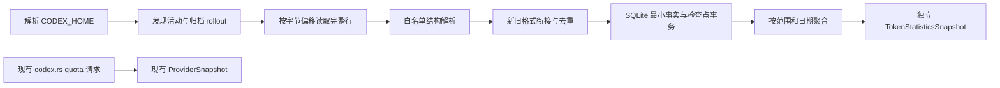

# Codex Monitor V1.0 — Token Statistics 设计

## 1. 本步交付与结论

本文是 Step 2 的设计产物，承接 [Step 1 源码分析](quota-float-analysis.md)。仅分析本机 Codex 数据结构并设计 Token Statistics 模块，不包含实现代码、数据库文件、应用逻辑或 UI 修改。

建议以 **Rust 只读扫描 Codex rollout JSONL → 提取最小 Token 事实 → 去重与格式衔接 → 按时间汇总 → 独立统计契约** 实现。现有 quota 请求、`ProviderSnapshot`、刷新锁和错误降级保持原职责。

关键发现：

1. 本机同时存在旧式 `event_msg / token_count` 与新式 `token_usage_record`；后者包含逐 response 用量和标识，应优先使用。
2. 旧式 `total_token_usage` 是累计快照，存在重复及回退。不能累加每一条 total，也不能把最后一条 total 当成所有历史用量。
3. 同一 rollout 可以先写旧格式，后写新格式。不能看到新记录就丢弃整个旧格式历史，也不能同时累计两种记录。
4. 数据来自当前本机、当前有效 CODEX_HOME 下可识别的 Codex 用量记录；已确认并持久化的最小统计事实不随源日志删除。不能据此宣称账户全量、跨设备全量、官方账单或可换算的 quota 消耗。

本次修订基于提交 `2485f32a70c56956b71d7f1931062dcbc20c01d9`。今日、本周、本月、总计、统计范围和事实保留规则已明确，见第 4 节。SQLite 为建议的主持久化方案；文中的技术建议与合成验收场景均是后续开发输入，不表示已实现或测试通过。

## 2. 证据、方法与限制

### 2.1 原始分析基线与本次修订基线

- 操作系统：macOS（`uname -s` 返回 `Darwin`）。
- 原始分析仓库：`bennick1/codex-monitor`，当时 `HEAD = 9b9bd1b`，提交说明 `docs: analyze quota-float architecture`。
- 原始只读分析开始时工作树干净；当时未核验远端最新提交。Step 2 初稿随后以 `2485f32a70c56956b71d7f1931062dcbc20c01d9` 提交并推送。
- 本次定向修订开始时 `main` 指向上述 Step 2 提交，工作区干净。仅核对文档与相关引用，沿用下述抽样证据，不重新扫描本机日志。
- 当前仍为 Quota Float 0.2.4 的 React / TypeScript / Tauri 2 / Rust 工程。
- 实际检查了 `src-tauri/src/codex.rs` 的目录解析、`lib.rs` 的 `AppState`、`models.rs` 的 snapshot、`src/lib/bridge.ts` 和 `Cargo.toml`。
- 已有 `serde_json`、`chrono`、`dirs`、`sha2` 和 `tokio`；没有 SQLite 或文件监听依赖。现有 `tokio` 显式 features 为 `macros, sync`，不能假设新增异步文件 API 已可用。

### 2.2 本机只读检查

以下为初稿在 2026-09-05 取得的只读检查证据，本次修订未重新执行扫描或 SQLite 检查。路径以 `<CODEX_HOME>` 代替本机用户目录。

| 检查项 | 证据与边界 |
| --- | --- |
| 目录盘点 | 初次盘点 `sessions` 有 182 个 JSONL，约 956 MB；`archived_sessions` 有 1 个 JSONL，约 3.27 MB。MB 为十进制，运行中的文件会增长 |
| 样本选择 | 按文件 mtime 排序，取最早 3 个、中部 3 个、最近 12 个及归档 1 个，共 19 个；是结构抽样，不是全量账目核算 |
| 固定读入边界 | 2026-09-05 01:11:58 UTC 开始的一轮检查，每文件记录打开时大小，只读取该边界内完整换行记录；样本共 136,417,881 字节。不是跨文件一致性快照 |
| 数据最小化 | 仅输出字段、版本、来源标签、计数及数值关系；未导出正文、真实会话标识、项目路径、认证内容或原始日志 |
| SQLite | 仅以 `mode=ro&immutable=1` 检查现有主文件 schema；没有查询聊天数据、创建数据库或复制数据库。此方式忽略 WAL，只能作为主文件结构证据，不能用于实时统计 |
| 版本证据 | 样本 `cli_version` 包含 `0.142.5`、`0.146.0-alpha.3.1`、`0.146.0-alpha.9.2`、`0.153.0-alpha.5`；这些是 rollout 自报的引擎版本，不等同于 Desktop 安装包版本 |

### 2.3 可重复的数值检查结果

| 项目 | 固定读入边界样本结果 |
| --- | --- |
| `token_count` 条数 | 2,978 |
| 累计 total 等于 input + output | 2,978 / 2,978 |
| 累计 cached ≤ input、reasoning ≤ output | 2,978 / 2,978 |
| 相邻累计向量完全相同 | 48 次 |
| 相邻累计向量出现负差分 | 3 次 |
| 非负且有变化的累计差分 | 2,909 次；五个核心字段均与对应 `last_token_usage` 相等 |
| `token_usage_record` 条数 | 1,081；本轮未见缺失 response id 或重复的 `(thread_id, response_id)` |
| 新记录 `usage` 的 total / 子集关系 | 1,081 / 1,081 满足上述关系 |
| 同 thread 相邻 `thread_token_usage` 差分 | 1,070 次可比较，全部等于当条 `usage` 的五个核心字段 |
| 新记录与随后旧事件 | 1,080 次观察到随后 `token_count`，其中 1,064 次 last 与最近新记录 usage 相等；不能依赖逐条一一配对 |

五个核心字段是 input、cached input、output、reasoning output、total。可选的 `cache_write_input_tokens` 不参与该五字段比较；不能因旧版本缺少第六字段而误判差分异常。

样本中一个会话的新记录 usage 合计为 60,784,745，与末条新记录的 thread 累计一致；该会话末条旧式 total 仅为 9,821,980，并发生 3 次回退。这直接说明只读末条旧快照会漏算。上述数值仅用于说明字段关系，不是用户账户总用量。

### 2.4 官方资料适用范围

- 官方文档说明 Codex 本地状态位于 `CODEX_HOME`，默认 `~/.codex`：[Advanced Configuration — Config and state locations](https://learn.chatgpt.com/docs/config-file/config-advanced#config-and-state-locations)。
- 官方 App Server 文档提供 `thread/tokenUsage/updated` 通知，并描述 `account/usage/read` 的服务端汇总和可空的每日 buckets：[Codex App Server](https://learn.chatgpt.com/docs/app-server)。这些能力存在不等于能旁路订阅正在运行的 Desktop 进程，也不证明本地 JSONL schema 稳定。
- 本步没有调用账户接口、启动 App Server 或改变 Codex 配置。本文的本地字段及新旧格式差异来自本机检查，不将内部文件格式称为公开稳定 API。

## 3. 本地数据结构与数据源选择

### 3.1 目录和候选源

```text
<CODEX_HOME>/
├── sessions/YYYY/MM/DD/rollout-<timestamp>-<id>.jsonl
├── archived_sessions/rollout-<timestamp>-<id>.jsonl
├── session_index.jsonl
├── state_5.sqlite                  # 及既有 WAL / SHM
├── thread_history_1.sqlite         # 及既有 WAL / SHM
├── logs_2.sqlite / goals_1.sqlite / queue_1.sqlite / memories_1.sqlite
├── config.toml
└── auth.json
```

这是本机观察到的结构。数据库数字后缀不是跨版本契约；归档目录在本机为平铺，扫描器应允许其内部子目录。`history.jsonl` 本次未在根目录发现，不能将它作为必需文件。

| 候选源 | 本机事实 | 设计选择 |
| --- | --- | --- |
| rollout JSONL | 包含结构化 Token 事件、时间及会话上下文 | 主数据源；活动和归档进入同一去重域 |
| `session_index.jsonl` | 抽查字段为 `id, thread_name, updated_at` | 无 Token 明细，不依赖标题索引发现会话 |
| `state_5.sqlite` | `threads` 有 `id, rollout_path, tokens_used, archived, cli_version, model, history_mode` 等字段，也包含标题、正文摘要、cwd 等敏感字段 | 不作为 V1 统计源；`tokens_used` 单值不足以支持分类、每日归属与去重，且本步未确认其业务语义 |
| `thread_history_1.sqlite` | `thread_turns, thread_items, thread_history_projection_state, thread_realtime_items`；有 rollout ordinal/byte offset、JSON 内容等字段 | 已检查的主文件 schema 未见独立 Token 明细表；不读取聊天投影来估算 Token |
| 日志、queue、goals、memories 数据库 | 文件存在，未分析数据内容 | 排除；不是本步所需计量来源 |
| `auth.json` / `config.toml` | 文件存在 | Token Collector 不需要读取凭据；不复制 quota 的认证链路 |
| quota API / App Server | 配额与在线服务能力 | 不与本地 Token 数据混算，不从额度百分比反推 Token |

### 3.2 路径解析

沿用现有规则：进程有效 `CODEX_HOME` 优先，否则用户主目录下 `.codex`。macOS 默认 `~/.codex`，Windows 默认用户 profile 下 `.codex`；Windows 是设计目标，本步未实机验证。

扫描范围仅限已解析根目录中的 `sessions` 和 `archived_sessions`。根目录规范化后作为来源命名空间；不自动扫描整个用户目录、其他账户、网络盘或远程机器。GUI 进程与终端环境变量可能不同，返回“目录不可用”时应能区分未找到根目录与未找到会话。

显式 `CODEX_HOME` 为空或无效时返回配置问题，不悄悄改扫另一个目录。对根目录内的链接、Windows junction 和重解析点检查真实路径，默认不跟随越出来源根目录的目标；不能读取管道、设备文件或套接字。

### 3.3 JSONL 外层与上下文

每行是独立 JSON 对象，常见外层字段为 `timestamp, type, payload`；新记录还可有 `ordinal`。字段顺序不构成契约。

| 类型 | 可提取字段 | 用途 |
| --- | --- | --- |
| `session_meta` | `id, session_id, parent_thread_id, timestamp, cli_version, originator, source, thread_source, history_mode` | 身份、来源、版本与关系；忽略 base instructions、git、cwd 和动态工具正文 |
| `turn_context` | `turn_id, root_turn_id, model` | 可选 turn/model 关联；不保存 prompt、summary 或配置正文 |
| `event_msg` + payload.type=`token_count` | `info.total_token_usage, info.last_token_usage` | 旧格式计量；忽略其中 `rate_limits` |
| `token_usage_record` | 见下一节 | 新格式计量 |
| 其他类型 | 仅识别类型并跳过 | 不分析 response、工具输出、reasoning、compacted 正文来估算 Token |

本机同一 rollout 内发现最多 15 条 `session_meta`。重复 metadata 不是新会话或累计清零依据。子代理的 `id` 与 `session_id` 可能不同，不能仅以 `session_id` 聚合全部线程；thread 主身份优先使用 `session_meta.id`，新记录再以 `payload.thread_id` 交叉核对。

样本来源既有 `originator = Codex Desktop`，也有 `codex_work_desktop`，而主会话 `source` 都可为 `vscode`。仅按 `source == vscode` 排除会漏掉 Desktop。originator 可以提供正向识别证据，但不足以证明所有历史或混合客户端会话都能完整分类。

### 3.4 新格式：逐 response 记录

结构示意，使用占位符而非真实会话数据：

```text
type: token_usage_record
timestamp, ordinal?
payload:
  thread_id, turn_id, session_id, root_turn_id, response_id
  usage:                  本条 response 用量向量
  turn_token_usage:        turn 累计向量
  thread_token_usage:      当前新格式计量段的 thread 累计向量
```

采集事实来自 `usage`，后两者用于一致性检查，不能再次相加。把 thread 累计称为“计量段累计”是保守设计：混合格式样本中新格式计量从自身零基线开始，没有携带旧格式的全部历史。

### 3.5 旧格式：累计快照

结构示意：

```text
type: event_msg
payload.type: token_count
payload.info:
  total_token_usage:       累计向量 C
  last_token_usage:        最近一次用量向量 L
  model_context_window:   上下文窗口容量，非累计用量
payload.rate_limits:      配额信息，不进入 Token 统计
```

`last_token_usage` 可能在重复通知中再次出现，不能无条件求和。`info = null`、可选字段缺失、未知类型均需要兼容；这些是设计防御分支，本轮固定样本未发现 null info。

## 4. 已确认的统计口径

### 4.1 来源范围与事实保留

V1 统计 **当前本机、当前有效 CODEX_HOME 下可识别的 Codex 用量记录**，包括活动日志、归档日志及有独立用量记录的子代理；同一响应只能计入一次。不设置 Desktop-only 过滤，不因 originator 或 source 标签不同排除可识别的 Codex 记录。不扩展其他 AI 工具、ChatGPT 网页聊天、跨设备同步或账号归属管理。

这不是“当前登录账户的官方全量用量”。登录切换不会改变已采集历史的计量；Collector 不读取账户标识来猜测归属。首次扫描只能回填当前仍可访问的历史，无法恢复安装前已经删除或从未写入本机的日志；不能命名为账户 lifetime。远端主机、云端专有记录及未持久化记录不在可证范围内。语音会话只有出现兼容的 Token 记录才纳入，不依据时长估算。

父任务与子代理按各自 response 计数一次；不再把子代理总量加到已经做过树级合并的父总量上。发现子代理关系但缺少其用量且从未采集时，报告可观测范围缺口，不用父累计反推补齐。

已确认并持久化的统计事实独立于源文件保留。原始 rollout 删除、文件暂时不可读、权限失败或目录扫描未完成都不清空已有结果。归档、复制、重扫和重启不会新增重复用量；有证据的解析修正或去重纠错可以调整统计，因此总计不要求绝对单调递增。

持久化数据按来源根目录隔离。有效 CODEX_HOME 变化后，查询只选择当前根目录命名空间；旧命名空间事实保留但不自动合并。根目录搬迁是否属于同一来源不能靠路径相似猜测，V1 不自动执行来源合并。

### 4.2 指标含义

| 指标 | 字段及规则 |
| --- | --- |
| 输入 Token | `input_tokens`，包含 cached input |
| 缓存输入 Token | `cached_input_tokens`，是输入的子集 |
| 输出 Token | `output_tokens`，包含 reasoning output |
| 推理输出 Token | `reasoning_output_tokens`，是输出的子集 |
| 总 Token | `total_tokens`；已支持样本应等于 input + output |
| 非缓存输入 | input − cached；仅两者有效且关系成立时可推导，不作为新增必选展示项 |

因此 **total = input + output**，不能再加 cached 或 reasoning。`cache_write_input_tokens` 本机新样本可见，作为可选扩展字段保留兼容，不在未知语义下额外加到 total。

所有计数须为非负整数。核心 input/output/total 缺失、负数、溢出或 total 关系冲突时拒收该事实并累计质量问题；不静默改写原数值。cached/reasoning 可选缺失时，主指标仍可计入，缺失维度返回 null 和缺失事实数，而不是当作 0。可选字段存在但违反子集关系时，该维度不可用并标记 partial。

Rust 使用检查溢出的整数运算；Tauri JSON 的计数字段建议使用十进制字符串，防止超过 JavaScript 安全整数范围。格式化单位只发生在未来展示端，底层不提前舍入。

### 4.3 四项统计与统一查询时刻

一次查询固定系统本地时区 Z、查询时刻 Q（UTC）及已提交数据库快照 generation；四项统计使用同一组参数，扫描期间的新提交不混入本次结果。查询上界一律是 Q，采用左闭右开区间，不使用下一日、下一周或下一月作为查询上界。

| 统计项 | 标识 | 固定口径 |
| --- | --- | --- |
| 今日 | today | 系统本地时间今天 00:00 至本次查询时刻 Q |
| 本周 | thisWeek | 系统本地时间本周一 00:00 至 Q，按自然周计算，允许跨月、跨年 |
| 本月 | thisMonth | 系统本地时间本月 1 日 00:00 至 Q，按自然月计算 |
| 总计 | total | 本工具在当前来源范围内已采集、确认、持久化并去重的本机 Codex Token 用量；按下述时间有效性规则纳入 |

每条事实按 Token 事件的外层 timestamp 判断时刻，不按目录日期、会话创建日、mtime 或扫描时间归属。UTC 保存事件时刻；查询时在固定 Z 中构造日、周、月的本地日历边界，再转换为 UTC，用 `[startUtc, Q)` 查询。按本地日历处理夏令时，不通过减去固定小时数构造周/月边界；本地午夜有偏移变化时采用该日首个有效时刻，重叠时选最早对应时刻，具体时区库行为须验证。系统时区变化后重新分桶，不改变已保存的 UTC 事实。Q 恰等于期间起点时返回空区间 0，不作为非法范围。

一次跨午夜的 response 全部归属其有效记录时刻，不按持续时长拆分。一个已采集事实的时间若为 Q 或晚于 Q，本次四项统计均不纳入；保留为 futureDeferred 并报告计数，后续查询超过该时间后再按规则纳入。不得通过降级为 undated 绕过未来时间检查。未来时间可能来自设备时钟偏差，等待或修正须有证据。

### 4.4 时间不明事实与总计的关系

用量数值及去重身份已确认，和发生时间已确认，是两项独立判断。无法确认用量或响应归属的候选仍隔离，不计入任何统计；仅时间无法确认的已确认事实单独保留。

- dated：有可用 UTC 发生时刻且早于 Q，计入总计，并按各期间边界计入今日、本周、本月。
- undated：timestamp 缺失或无效，但用量与去重已确认。计入总计，单列 undatedTotals；不强行归入今天，也不分配到周/月。
- timeUncertain：旧累计跨日志缺口形成的确认区间用量，无法确定每个响应时刻。保留可知区间端点，单列 timeUncertainTotals，V1 不将其分配到期间。可知端点若在 Q 或之后，则先列 futureDeferred，不提前计入总计。
- futureDeferred：存在明确的未来时刻/区间端点，本次总计与期间统计均排除，单列待纳入数量；不与上述三类重复。

总计 = datedTotals + undatedTotals + timeUncertainTotals，均只取当前数据库快照中的 active、confirmed、未被替代事实。今日、本周、本月仅从 dated 取对应区间；三者互有交叠，不能彼此相加来核对总计。期间统计无法覆盖时间不明用量时标记 partial 并返回问题计数，不能把“未能归属”解释为 0 用量。只有来源缺失而无用量证据的历史不计入总计。

统计只描述 Token 活动，不在 V1 推导费用、套餐余额、模型价格或官方计费 Token。

## 5. 采集架构与职责



后续 Rust 模块建议集中放在 `src-tauri/src/token_stats/`，按职责划分 resolver、reader、normalizer、store、aggregator；实现阶段可按实际体量合并文件。本步不创建模块。

- Resolver：来源根目录、路径安全和文件发现。
- Reader：流式读完整 JSONL、检查点和文件变化检测。
- Normalizer：只提取白名单字段，管理格式模式、计数向量、身份、去重和质量问题。
- Store：SQLite 中保留最小事实、来源引用、格式切换状态和检查点，通过事务完成幂等写入与纠错；可重建聚合缓存不代替事实。
- Aggregator：时间区间、各维度和质量汇总。
- Service：独立后台扫描、缓存和 command 接入，不能占用现有 quota `fetch_lock`。

目录遍历和大文件解析放到单独阻塞 worker，不在 Tauri UI 线程或持锁期间执行长扫描。仅短时间锁定快照替换；现有 quota 可以在扫描中正常刷新。

## 6. 归一化、去重与新旧格式衔接

### 6.1 新格式优先

1. 校验 `token_usage_record` 的身份、字段和数值，提取 `usage`。
2. 在一个来源根目录及 provider 命名空间内，以非空 `response_id` 作为强去重候选键，附带原始 thread 所属关系进行校验。同 thread 同 response 重播只能记一次。
3. 同 response 出现在不同 thread 时不能直接相加：若可证实为 fork/副本中的同一响应，保留一次及多个来源引用；不能解释的身份或数值冲突隔离并标记 partial。不同 provider 的响应 id 不相互去重。
4. `ordinal` 和字节偏移用于顺序、定位与重扫，不单独充当全局 response id。新记录缺失 response id 时不自动退回旧快照补算该条，以免混算；标记 unsupported/partial。
5. `thread_token_usage` 差分等于 usage 是校验信号，不是第二个计量入口。首条累计大于首条 usage 表示可能缺失前缀，记录缺口，不把累计差额分配到当日。

### 6.2 旧格式差分

状态按逻辑 thread 和已确认计量段保存，保留“上一条有效累计向量”，不用 timestamp 排序后差分。正常顺序是文件内物理追加顺序。

| 条件 | 处理 |
| --- | --- |
| 第一条 C 与有效 L 相同，且没有已知复制前缀 | 可从零建立基线，接纳 C；时间来自该事件 |
| 第一条 C 大于 L，无法确认完整历史 | C 只作后续差分基线；不将整段历史归到当前日期。首条 L 也不盲目认定为新请求，标记缺失前缀 |
| C 与上一有效 C 完全相同 | 重复通知，新增为 0；不重复加入 L |
| 差分各核心维度非负且一致 | 接纳差分 Δ；Δ 与 L 相等时可按单次观测时间归属 |
| Δ 与 L 不等 | 可能漏了中间事件；仅保留通过数值约束的区间用量及 gap 标志，按第 4.3 节处理日期 |
| 核心累计减少或向量不一致 | 不取绝对值、不逐字段截断为 0、不自动把新 C 全量加入。隔离异常段，保留先前已确认事实，标记 partial |
| 明确可验证的新计量段 | 建立新段基线；重复 session_meta、compacted 事件或模型变化单独都不足以证明清零 |
| 缺少有效 total，仅有 last | V1 不估算；跳过该计量候选并报告缺失 |

回退后若没有足够证据确认新段，该旧格式段持续不可计量，直到重扫或兼容规则消除歧义。宁可明确缺失，也不假装获得精确总量。

旧格式副本按同一逻辑 thread 的完整前缀核对后只选一条连续流；相同累计状态在同段中不重复计数。跨 thread 的历史复制必须结合父子关系和 Token 序列前缀核对，不能仅因数字相同就去重。无法区分 fork 复制与新响应时隔离冲突前缀并报告 partial；没有 response id 的历史不能承诺普遍精确的跨 fork 去重。

### 6.3 跨批次、跨重启的新旧格式衔接

每个逻辑 thread 的计量段持有 `legacy → transitionPending → responseRecords` 状态。状态、计量基线、边界证据、候选和已接纳事实的关联均持久化，不能只存在于 worker 内存。

**衔接证据。** 保存旧差分事实的前后累计向量、计量段、thread/turn 关联、事件时刻、源文件版本、边界 offset/ordinal 和最小事件序列锚点；新记录保存 response 标识和对应最小上下文。不保存会话正文。数字相等、时间接近、文件位置相邻或同属一个 turn，任何单一条件都不足以证明同一响应。

核对必须定位同一逻辑 thread 的同一计量段及唯一候选窗口，有可验证的 response 关联或经支持格式规则验证的完整、无缺口序列映射，并检查累计连续性、五维 usage 及多条候选之间的排他关系。复制、fork 或重复 metadata 引入的身份冲突也必须消除。相关格式不能提供足够关联证据时，返回 ambiguous，而不是宣称可以精确匹配。序列指纹只用于确认已识别来源中的序列一致性，不作为跨 thread 响应身份的替代。

**正常切换。** 在首条新记录前保留已确认的旧前缀及 C_before，暂存边界附近候选。旧累计差分与新 usage 相等且新累计从 usage 起步，是支持切换的数值证据；仍须结合上述身份和序列证据排除同数值的其他响应。证据充分时仅纳入一次新 usage；进入 responseRecords 后旧 token_count 只作诊断，不再次计量。不因 history_mode 或版本号单独选择解析器，也不因重复 session_meta 或旧事件再次出现自动切回 legacy。

**已提交旧事实后收到新记录。** Reader 读取新批次前从数据库恢复模式、检查点、未决候选和旧事实关联。将迟到新记录保存为 pending 候选，查找已提交的旧差分或区间事实，不能仅查询本轮尚未提交的数据。即使之前已进入 responseRecords，迟到记录仍应与持久化的衔接映射及 response 键核对。

- 一对一映射证据充分：在同一事务中，把旧事实标记 superseded，写入一次新规范事实（或关联已有相同 response 的事实），绑定 response 去重键，迁移来源引用，并保存替代关系、证据类型和规则版本。同步更新格式状态、检查点及 generation。总量由 active 事实计算，不能同时包含新旧两份。
- 多条新 usage 对应一条旧区间：只有身份、顺序和完整覆盖关系均可证且各维度合计一致时才整体替换；不能凭合计相等任意拆分。替换后有可靠时间证据才能重算期间归属。
- 已绑定相同 response：只补来源引用或忽略重播，不再加数；同键值冲突隔离并标记 partial，不覆盖可信事实。
- 证据不足：保留原已提交结果，新候选不计入；将 transitionPending/ambiguous、候选与旧事实引用、缺失证据原因同批持久化，相关范围标记 partial。不猜测“新增 120”或“必然重复”。后续有证据才能消歧；无证据可长期保持 partial。

只读完完整行但无法消歧时，可以推进检查点，前提是该行所需的最小候选及未决状态与检查点在同一事务中落库；否则不推进。候选解析后即使源文件删除也不能丢掉未决状态。源已不存在且持久化证据不足时保留已有事实和歧义，不能自动重建出缺失的对应关系。

**跨重启合成示例。** 假设已有确认旧前缀 1000，第一轮从旧累计 1000 → 1120 得到增量 120，事实及检查点已保存。重启后读到对应新 usage=120：证据充分时原子替换那条 120，前缀 1000 保留，总计仍为 1120；证据不足时保留 1120 和 pending 候选、标记 partial，不能盲目变成 1240。1120 是此时保留的已确认统计，不代表歧义已经消除。

初稿实测混合格式样本：首条新记录前旧累计为 227,654,843，新 usage 为 211,679，后继旧累计为 227,866,522；差额正好为 211,679，新 thread 累计也从 211,679 开始。这保留为数值衔接证据，并非上述跨重启匹配与事务算法已经通过验证。

### 6.4 归档、复制、重写与删除

- 路径是文件别名，不能作为会话唯一键；从 sessions 移到 archived_sessions 后总量不增加。重新出现的文件先匹配已保存的身份、序列和 response 键，即使旧别名已标记 missing，也不能创建重复事实。
- 同一 thread 有多个文件时核对前缀与 response 键。相同来源副本补充引用，不重复计量；分叉或冲突不按 mtime 任意选“最新”。缺乏足够证据时隔离不确定贡献。
- 文件变短、身份改变或边界指纹不匹配时重扫并建立新文件版本。重扫是对已有事实的核对，不把旧版本全部减去再加上当前文件；未在新文件中出现的旧事实继续保留。
- 每条事实保存持久化来源引用，源可用性只更新为 present、missing 或 unreadable。引用保留已读版本、位置和证据摘要，不对事实设置源文件删除级联。
- 仅在完整目录扫描确认缺失时标记 missing；暂时不可读、权限失败、扫描未完成不能当作源删除，也不清空已有结果。源已删除且事实已持久化时，原数值与原 UTC 归属继续保留。
- 只有可复核的解析修正、错误身份识别或重复计量证据才允许调整已确认事实，且以第 7 节的纠错事务保留最小替代关系。修正可增加或减少总计，不要求总计绝对单调递增。
- 删除源文件不会删除统计元数据；也不能把源文件后来消失当作事实从未存在。若统计数据库本身丢失且无可用备份，已删除源对应的事实可能无法恢复，这不同于清理可重建缓存。

## 7. 增量扫描与本地状态建议

### 7.1 扫描流程

1. 启动：打开应用统计数据库，读取已提交事实、检查点与格式状态，恢复已有统计并显示 scanning 状态；同时遍历来源目录，不阻塞 quota。不能先清空事实再开始扫描。
2. 首次回填：只对当前可访问文件流式解析。先扫描近期文件改善等待体验，但未完成所有文件前不能标记为已发现范围内完整；无法回填安装前已删除的日志。
3. 增量：建议每 15 秒发现新增/变化文件，只读已提交偏移之后的字节；这是初始调度建议，实际开销须实现后测量。
4. 恢复前台、系统唤醒或手动刷新：触发一次合并扫描；多个触发合并，最多一个扫描 worker。
5. 每轮固定每文件读入上限，持续写入的新尾部留待下一轮；查询快照记录扫描完成时间及读取边界，不能声称实时零延迟。
6. 仅在完整行对应的事实或隔离候选、状态及质量问题与检查点共同提交后推进持久化偏移。半行留在原偏移，下轮重读，处理 UTF-8 跨读取块和 CRLF。
7. 完整坏行跳过并记录脱敏错误位置；下一有效累计可能只恢复区间用量，不能恢复精确日期。过大行流式丢弃到换行，标记缺口，禁止无界分配内存。

建议单行解析上限初值 16 MiB、单批读取预算初值 8 MiB（行可跨批），均需后续用大文件压测校准。后台任务应可取消，单轮失败指数退避并上限 5 分钟；不使用现有 quota 的退避状态。

mtime 与长度用于快速发现变化，不是内容不变的绝对证明。保存文件原生身份、已读前缀/边界指纹；启动及低频完整核对验证已读内容摘要，以发现同长度覆盖。低频完整核对建议每天一次并后台限速；任意静默改写在核对前存在发现延迟，须披露。

### 7.2 主持久化与可重建缓存

建议使用 **SQLite 作为主持久化方案**，在 Tauri `app_local_data_dir` 对应的应用本地数据目录保存最小统计事实、去重身份、来源引用、格式切换状态和检查点，建议文件名 `token-statistics.sqlite3`。这是本工具自己的数据库，不是 Codex 的 state/history 数据库；不写入 CODEX_HOME、仓库、AgentConfig 或共享知识库，不新增网络同步。

已确认事实需要保留，不能仅放入可丢弃的 app cache JSON。内存快照、预计算日桶或 app cache 内派生结果可丢弃，并从主持久化事实重新计算；原始 rollout 不再是已确认历史的唯一恢复来源。派生缓存必须带事实 generation、时区和查询边界，不能用旧缓存拼接新事实。

本轮仅在文档内设计，不创建数据库、迁移文件或引入依赖。后续须选择兼容 Rust/Tauri 和 Windows/macOS 的 SQLite 驱动，明确 SQLite 版本、事务持久性设置、备份及升级策略并验证。建议本地单写者、短事务、受控 busy timeout、显式外键约束；可评估 WAL 与 FULL 同步设置，但不得套用初稿检查 Codex 主文件时的 immutable 只读模式。WAL/SHM 如被采用，也是应用本地持久化状态，备份不能只复制正在写入的主文件。

### 7.3 逻辑表、字段与唯一约束

以下仅为逻辑表设计，不是建表 SQL。计数采用 SQLite 非负 INTEGER 的受检查范围（不超过有符号 64 位上限）；事实字段及汇总均检查溢出。不能依靠 SQLite 隐式转浮点、截断或 JS number 保存大整数；超界时隔离候选或返回明确的汇总溢出状态，Tauri 仍以十进制字符串传输正常计数。

| 逻辑表 | 最小字段 | 主键、唯一约束与关系 |
| --- | --- | --- |
| source_roots | rootKey、规范化路径摘要、来源类型、首次/最近发现时间 | rootKey 主键；规范化来源身份唯一。真实绝对路径仅运行时解析 |
| source_files | fileKey、rootKey、logicalFileKey、根内相对路径、nativeIdentity、fileVersion、size/mtime、内容/边界指纹、availability | fileKey 主键；根内路径与文件版本组合唯一；logicalFileKey 连接归档/复制别名，不以路径单独识别会话 |
| file_checkpoints | fileKey、committedByteOffset、已读序列锚点、parserVersion、generation、scanStatus | fileKey 主键并引用 source_files；检查点仅对匹配的 fileVersion 有效 |
| thread_segments | segmentKey、rootKey、providerKey、threadKey、父/turn 关联、previousTotal、mode、legacyBoundaryFactKeys、transitionEvidenceVersion、qualityFlags、revision | segmentKey 主键；来源、provider、thread 与计量段组合唯一；新段须有证据，不因 metadata 重复自增 |
| token_facts | factKey、rootKey、segmentKey、threadKey、turnKey（可空）、occurredAtUtc 或区间端点、timeStatus、五维计数、可选 cache write、originFormat、lifecycleState、confirmationStatus、confirmedAt、ruleVersion、revision | factKey 主键；仅 lifecycleState=active 且 confirmationStatus=confirmed 计入。旧事实保留前后累计向量及序列锚点；superseded 保留用于防重与纠错，不再汇总 |
| fact_identities | rootKey、providerKey、identityKind、identityKey、canonicalFactKey | 来源/provider/种类/键联合唯一；response 身份只能映射一个规范事实。旧身份使用已验证逻辑流中的段与事件锚点，不以 Token 数字作键 |
| fact_sources | factKey、fileKey、startOffset/endOffset、ordinal（可空）、最小证据摘要 | 事实、文件版本、事件锚点组合唯一；外键禁止对事实级联删除。源 missing 时仍保留该引用及元数据 |
| reconciliation_candidates | candidateKey、segmentKey、规范化标识/计数/时间、源锚点、关联旧 factKeys、处理状态、reasonCode、evidenceSummary | candidateKey 主键；同文件版本同事件锚点唯一；不同别名再经身份核对。pending/ambiguous 不计入总量 |
| reconciliation_links | resolutionKey、候选与旧/新 factKeys、关系角色、证据类型/摘要、ruleVersion、resolvedAt、revision | resolutionKey 与关联事实/角色组合唯一；一次替换/合并有稳定 resolutionKey，重放不得再次调整 |
| statistics_meta | schemaVersion、parserVersion、generation、lastScanAt、lastSuccessAt、最近事件时间、扫描进度及问题计数 | 单例版本/提交状态；generation 在事实或计量状态事务中推进 |

一对一替换时，身份表将现代 response 键与旧事件键关联到同一个规范事实，不创建可同时计量的第二份。多条新响应整体替换一条旧区间时，旧事件键继续指向不可计量的 superseded 旧事实，由 reconciliation_links 连接全部替代事实；旧区间重播命中已解决关系后不再计量，不能把整个旧区间键随意绑定到某一个子响应。跨 thread 的同 response 冲突须先核对身份，第 6.1 节的隔离规则优先，不能使用“唯一键冲突就覆盖”。旧源已删除时身份键、旧前后累计向量及切换关系仍保留；这既防止重新导入重复，也为迟到记录提供有限但持久的核对证据。

标识可用现有 SHA-256 派生不透明键；哈希用于索引、脱敏和一致性，不代表加密。证据摘要仅含白名单结构、数值及关系，不包含原始事件正文；一个哈希相同不能代替业务身份核对。模型名仅在同 thread/turn 严格关联时保存为可选 metadata，不猜实际服务端路由；V1 不要求按模型或项目汇总。

### 7.4 事实与检查点的事务一致性

解析在写事务外进行；提交前确认文件版本、旧检查点和 thread 状态 revision 仍与本批读取基线一致，否则放弃该候选批并重新核对。应用只允许一个扫描写者；不能长时间持事务读完整日志。

每批在一个 SQLite 事务内完成以下操作：

1. 校验来源版本和原检查点，按唯一身份查找已有规范事实。
2. 写入新确认事实及身份/来源引用，或将未解决记录写入 reconciliation_candidates；坏行、未知格式和缺口也保存必要问题状态。
3. 如发生纠错，原子保存 resolution、将被替代事实标记 superseded、绑定新规范事实及旧/新身份键，并将相应候选标记 resolved；保存其来源引用和格式模式、累计基线、未决边界状态。所有替代关系须同根、无环；候选或旧事实已解决时重放只核对，不再执行数值调整。
4. 推进本批完整且已处理记录的 committedByteOffset，同时更新 generation、扫描质量及最后成功时间。若维护数据库内派生汇总，也在此事务更新；否则只使对应缓存失效。
5. 提交成功后，才发布新的内存快照与通知。前端统计从同一读事务快照计算四项结果。

事务提交前中断：事实、候选、纠错、格式状态与检查点一起回滚，重启从旧检查点重读。提交后、通知前中断：重启加载新 generation，唯一身份与 resolutionKey 保证不重复。不能出现检查点已推进而事实/隔离候选未保存，也不能提交新事实却留下会再次增加同笔用量的旧状态。

磁盘满、忙超时或提交失败时保留最后已提交结果，报告 persistenceDegraded 与 stale，不把本轮未提交内存增量当作已确认总计，也不推进检查点。源在失败后消失的未提交尾部可能无法恢复，必须报告缺口；这不能通过加上累计值猜补。正常源删除只更新 availability，不删除已提交事实或去重/衔接证据。

### 7.5 版本升级与恢复原则

- schemaVersion 与 parserVersion 分离；升级前采用 SQLite 一致性备份方式，在本机保留可恢复副本。升级事务成功才发布新版本，失败回滚并保留原库。备份不进入仓库或共享目录；本轮不编写升级文件。
- 检测到未来/不支持的 schemaVersion 时停止写入并报告不兼容，不覆盖、不建空库替代；兼容的旧结果可只读提供，否则 unavailable。不得把需要保留的统计事实当缓存删除重建。
- parserVersion 改变时先评估兼容性，不一律使事实失效。可访问源在新版本解析后以有证据的纠错事务调整；源已删除时保留原确认事实及 ruleVersion，并标记无法复核。若旧规则已知错误而缺少可修正证据，隔离受影响事实并报告 partial，保留元数据而不猜数值。
- 数据库损坏时停止写入，保留原文件并从有效一致性备份恢复；只靠当前源重扫无法保证恢复已删除日志对应事实。无完整备份时明确历史缺口，不能宣称恢复完整。
- 清理派生缓存只影响速度；不能级联删除 token_facts、fact_identities、reconciliation_links、候选或必要检查点。V1 不在本轮扩展数据清除界面、跨设备同步或账号迁移功能。

### 7.6 隐私边界

不保存标题、prompt、回答、推理正文、工具参数与结果、源代码、cwd、Git remote、凭据或原始 JSON 行。文件相对路径和偏移只为重扫、对账服务，不返回前端。

**源会话删除后，已经采集的最小统计元数据仍可能保留，但不保存会话正文。** 保留范围包括必要的数值、UTC 时间/时间质量、去重标识、来源引用、衔接/纠错证据及检查点；数据库与本机恢复副本均按当前用户权限保护，不上传。此保留规则需要在未来产品隐私说明中披露；本轮仅更新设计，不修改现有隐私文件或应用行为。

## 8. 后端接口与故障隔离

后续建议新增独立 Tauri commands，具体注册留待开发步骤：

| Command | 行为 |
| --- | --- |
| `get_token_statistics` | 按同一 Q、系统本地时区及已提交 generation 返回今日、本周、本月、总计；不接受自定义时间预置，不同步遍历大文件 |
| `refresh_token_statistics` | 合并触发后台扫描，返回扫描标识和当前状态，不触发 quota 网络请求 |

四项区间由后端按第 4.3 节构造；前端不能传入任意磁盘路径、来源筛选或未来上界。时区/时钟读取失败时报告查询不可用，不偷换 UTC 自然日。建议成功提交扫描或纠错后发送 `token-statistics-updated`，不包含原始记录；现有 `refresh-requested` 的行为不在本步改变。

返回契约建议：

- schemaVersion、generation、scope 固定为 localCodexHome、queryAtUtc、timeZone，以及今日/本周/本月实际 UTC 起点；同一次返回的上界均为 queryAtUtc。
- today、thisWeek、thisMonth、total：分别含 inputTokens、cachedInputTokens、outputTokens、reasoningOutputTokens、totalTokens 及本项质量；计数为十进制字符串，可选缺失指标为 null。
- datedTotals、undatedTotals、timeUncertainTotals 为 total 的互斥组成；另列 futureDeferred 数量/用量、pending/ambiguous 数量，后两类不计入已确认总计。
- status、isStale、lastScanAt、lastSuccessAt、latestUsageAt；零活动不等于扫描失败。
- coverage：已发现/已扫描/失败文件数、源已缺失但事实仍保留的文件数、有兼容用量的 thread 数、无用量记录的 thread 数、最早最晚可归属事件时间；当前源覆盖与已采集历史保留分别说明。
- quality：重复数、冲突数、坏行数、未知格式数、缺失前缀/区间数、缺失可选指标数、来源缺口与持久化问题数；warningCodes 使用固定枚举。

主状态建议为 scanning、ready、empty、partial、unavailable；stale 是独立标志，可与 partial 同时存在。只在发现范围完整扫描且没有阻碍所选指标的问题时返回 ready；ready 表示已发现源及已保留事实完成本次处理，不证明账户全量。已确认源删除而事实完整保留本身不使总计失效；新尾部不可读、时间不明或衔接歧义分别影响对应质量状态。

| 情形 | 行为 |
| --- | --- |
| 根目录不存在/不可读 | 无旧结果时 unavailable、四项值为 null；有当前来源的已提交事实时保留并标记 stale |
| 完整扫描、没有已保留事实且没有候选或异常 | empty；零仅表示未采集到兼容记录，不表示账户从未使用。只有未来记录/隔离候选时标记 partial，不冒充空数据 |
| 源已删除但保留有确认事实 | 返回已保留统计及缺失源数量，不因目录空而返回 empty |
| 数据库写入失败 | 保留最后已提交结果，persistenceDegraded、stale；检查点不前移 |
| 数据库损坏或版本不兼容 | 保留原库，停止写入；可验证旧结果才返回 stale，否则 unavailable，不自动建空库 |
| 部分文件不可读或格式不支持 | partial，返回已确认部分及问题计数 |
| 正在首次回填 | scanning，不冒充完整统计 |
| 增量失败且有旧快照 | 保留最后一致结果、isStale=true，记录最后成功时间 |
| quota signed_out 或网络失败 | 本地 Token 统计仍独立工作 |
| Token 解析失败 | 不改变 ProviderSnapshot、quota 剩余额度或现有 UI 状态 |

本步不设计窗口布局、皮肤、按钮或组件。后续 UI 必须遵循既有 306 × 306 内容约束，布局另行确认。

## 9. 后续实现验收设计

以下是需要在实现阶段执行的验证，不是本步已通过的测试。测试夹具应人工合成并覆盖已观察 schema，不复制用户原始 rollout。

| 场景 | 预期结果 |
| --- | --- |
| 新记录 input=100、cached=40、output=20、reasoning=5、total=120 | total 为 120；不把子集相加成 165 |
| 同 response 重播、重复扫描、应用重启 | 只计一次；检查点和事实一致恢复 |
| 旧累计 120 → 120 → 170，对应有效增量 120、0、50 | 总量 170；重复 last 不再相加 |
| 新旧格式同时记录一条请求 | 只计一次，旧通知迟到也不重复 |
| 旧前缀 1,000，新 usage 120，后继旧累计 1,120 | 切换确认后总量 1,120，不是 120 或 1,240 |
| 切换边界无法证明 | 保留已确认前缀，后续不确定贡献隔离，partial |
| 第一轮旧累计 1000 → 1120 已保存，重启后读到对应新 usage=120，身份及完整序列证据充分 | 同事务替换已提交的旧 120 并保存映射/检查点，总计仍为 1120；再次重扫不增加 |
| 同上但仅 Token 数值相等，无法证明对应 | 保留已提交 1120，持久化 ambiguous 候选并标记 partial，不能变成 1240；再次重启仍保留歧义 |
| 跨批次 pending 候选已保存，随后源日志删除 | 已确认事实保留；有足够已存证据才能消歧，否则持续 partial，不能丢候选后重新累加 |
| 旧累计 170 → 20，无清零证据 | 不新增 20，异常段被标记；不会生成负用量 |
| 首个累计明显包含不可见前缀 | 不将全部累计写入今天，coverage 标记缺口 |
| 同会话重复 session_meta、resume、compaction | 不新增会话、不自动重置累计 |
| 主任务和子代理、fork 复制历史 | 每个可确认 response 一次；旧格式无法确认的复制部分显式 partial |
| 活动目录移动到归档、两个目录临时共存 | 总量不增加；来源引用仍可追踪 |
| 文件截断/替换/同长度覆盖 | 重扫核对；消失的旧事实保留，仅证据充分的解析/去重修正可调整计数 |
| 唯一源日志删除后重启、清理派生缓存 | SQLite 中已确认事实、UTC 归属及去重键仍在，总计与期间统计在同一 Q 下不变 |
| 已删除源重新复制导入、归档路径改变 | 匹配持久化身份和序列，仅补引用，不重复计量 |
| 权限失败或目录扫描中断 | 保留已提交统计，不清空、不把暂时不可读当删除 |
| 证据充分的解析修正或去重纠错 | 原子更新规范事实与替代关系，总计可合理下降，重复纠错不再调整 |
| 尾部半行、CRLF、多字节字符跨批 | 完整后只计一次，提交偏移准确 |
| null info、坏行、超大行、新字段 | 无崩溃；恢复后保留质量问题，不用 0 掩盖未知 |
| 无 Token 记录的语音会话 | 不依据语音时长推算 Token |
| 自然周跨月：本地 Q=2026-09-05 10:00 | 本周起点为 2026-08-31 00:00，本月起点为 2026-09-01 00:00，均截止 Q；8 月 31 日记录可计本周而不计本月 |
| 自然月切换：本地 Q=2026-10-01 00:00 | 本月为空区间；9 月记录不再属于本月，总计保留；本周仍从 9 月 28 日周一起算 |
| 午夜、夏令时、系统时区改变 | 使用查询固定时区的日历边界，不减固定小时；重新分桶不重复计量 |
| 事件时刻等于 Q 或晚于 Q，下一查询超过该时刻 | 本次四项均排除并列 futureDeferred，后续符合边界时仅纳入一次 |
| 跨日缺口及无效 timestamp，用量和身份已确认 | 进入总计的 timeUncertain/undated，期间不纳入并标 partial；可知端点未来则先列 futureDeferred |
| 可选字段缺失、整数超过 JS 安全范围 | 缺失为 null；十进制字符串往返精确 |
| 扫描中读取接口、并发手动刷新、退出中断 | 快照 generation 一致，扫描合并，quota 无阻塞 |
| 事实已写但检查点尚未推进时事务中断 | 整批回滚，重启按旧检查点重读；无丢计、无双计 |
| 检查点 SQL 已执行但 COMMIT 前中断 | 事实、状态和检查点一起回滚，不跳过未提交记录 |
| COMMIT 后、通知前崩溃 | 新 generation 已完整保存，重启不会再次增加同笔用量 |
| 迟到新记录替换旧事实的事务中断 | 要么完整旧事实，要么完整新规范事实与映射，不能两份同时 active 或两份都丢失 |
| 磁盘满、数据库忙、数据库损坏、未知 schemaVersion | 保留已提交状态并报告问题，不建空库代替，不推进失败批检查点 |
| 解析器升级而源已删除 | 保留原事实及规则版本并注明不可复核；已知错误无修正证据时隔离，不猜测重建 |
| 接近本机规模的 1 GB 合成日志回填 | 记录耗时/内存/IO；UI 可响应；静止后的增量轮不反复全读 |
| macOS 与 Windows Unicode 路径、链接、文件占用 | 不越界读取，错误可恢复；实机验证后才能宣称跨平台可用 |

新增实现完成后，还需运行既有前端/Rust 回归，确认 quota、缓存和窗口行为没有变化。本步没有实现代码，因此未安装依赖、运行应用、构建或执行这些功能测试。

## 10. 修订结论与仍未验证的边界

已固定今日、本周、本月、总计口径及当前本机有效 CODEX_HOME 的采集范围；源删除不撤销已持久化事实，解析与去重纠错允许调整。文档建议由应用本地数据目录的 SQLite 保存最小事实和检查点，以事务协调迟到新记录与已提交旧事实；派生缓存可以重建，累计事实不能当作缓存清空。

仍未验证：各版本内部格式的完整覆盖、跨 fork 的旧格式精确身份判定、跨批次/跨重启的充分映射证据、SQLite 驱动和持久性/备份配置、事务中断恢复、升级恢复、Windows 路径及文件占用、时区库在日历边界及夏令时异常下的行为、大文件性能预算、全量本机账目与官方数据差异。远程/云端覆盖、跨设备同步和账号归属管理属于范围外能力，不是本轮待实现事项。

本机 rollout 内部格式会变化，未来需兼容测试；格式不识别时报告缺失，不切换到读取聊天正文估算。第 9 节全部是合成验收设计，本次没有执行；第 2 节是沿用初稿的只读抽样证据，不代表修订后的实现已验证。

本轮文档统一为 `docs/token-statistics-design.md`，不保留重复初稿。仅进行文档修订、引用核对、实际 diff 检查及按既有 main/origin 流程提交推送，不强制推送；没有修改 Rust、TypeScript、CSS、依赖、构建配置、quota、窗口、应用名称或更新设置，没有创建数据库、迁移、测试代码或 UI。完成后停留在 Step 2，不自动进入 Step 3。
